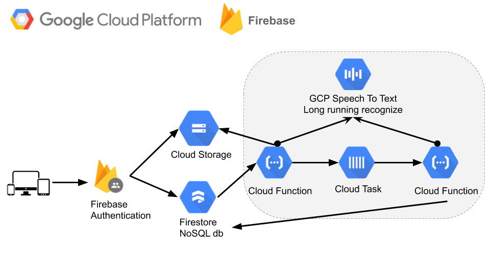

# Digital Paper Edit - Firebase

<!-- _One liner + link to confluence page_
_Screenshot of UI - optional_ -->

An application to make it faster, easier and more accessible to edit audio and video interviews using automatically generated transcriptions from STT(Speech To Text) services.

See [intro](./docs/intro.md) for more info on the project. And [user journey](./docs/user-journey/user-journey.md) for a high level overview of the user journey.

This is a web app version of [autoedit.io](https://www.autoedit.io) desktop app. If you are not a developer and are looking for a ready to use version check out the desktop app.

If you are a developer, and are not just working on this repo but are also working across the other repositories for this project, you can check out [the docs notes guides 'Visual Code Workspace Setup'](./docs/guides/visual-code-workspace-setup.md), for ease of development.

This project uses [Github project boards to track progress](https://github.com/pietrop/digital-paper-edit-firebase/projects)

You can also checkout the [autoEdit 3 (Digital Paper Edit) project board](https://github.com/users/pietrop/projects/1), that tracks issues and tickets across repositories.

## Setup

<!-- _stack - optional_
_How to build and run the code/app_ -->

### Firebase project

Setup a firebase project on [Google Cloud Firebase Dashboard](https://firebase.google.com/). See [firebase docs](https://firebase.google.com/docs/web/setup), or [these notes](https://textav.gitbook.io/firebase-react-notes/react-+-firebase/firebase-create-react-app-setup) for more info.

### Configuration

#### `.env`

Duplicate [`.env.example`](./env.example) into `.env`, and fill in the credentials details.
From [firebase dashboard](https://console.firebase.google.com/u/0/)

`Project settings` → `Your apps` → `Firebase SDK snippet`→ `CDN`

```env
# App name used in browser title and navbar
REACT_APP_NAME=""
REACT_APP_NODE_ENV="development"
REACT_APP_AUTH_DOMAIN=
REACT_APP_DATABASE_URL=
REACT_APP_PROJECT_ID=digital-paper-edit
REACT_APP_STORAGE_BUCKET=
REACT_APP_MESSAGING_SENDER_ID=
REACT_APP_APP_ID=
REACT_APP_MEASUREMENT_ID=
REACT_APP_API_KEY=
```

#### Firebase API key for cloud function

To get the value for `REACT_APP_API_KEY`. Go to the [firebase dashboard](https://console.firebase.google.com/u/0/), ans you can find it under:

`Project settings` → `Your Project` → `Web API Key`

set env in cloud function

```console
cd functions
```

set the Firebase web API key as env var for cloud functions, to be able to use to call the GCP STT operation end point, outside of the STT SDK to check progress of a transcription.

```console
firebase functions:config:set webapi.key="THE FIREBASE WEB API KEY"

```

[more info here](https://stackoverflow.com/questions/34442739/how-does-one-set-private-environment-variables-on-firebase-hosting)

### Firebase tools

Install firebase tools on your local system, if you don't already have them

```console
npm install -g firebase-tools
```

### Create a Google Queue

[Create a Google Queue ](https://cloud.google.com/tasks/docs/creating-queues#creating_a_queue) (`firestore-stt`) to use Google Task within this project. This is for using [GCP STT](https://cloud.google.com/speech-to-text) with firebase cloud functions. See architecture diagram for more info.

```console
gcloud tasks queues create `firestore-stt`
```

if you don't have [`gcloud`](https://cloud.google.com/sdk/gcloud) you can either set it up, or use the [gcp cloud shell](https://cloud.google.com/shell), in [cloud console](https://cloud.google.com/cloud-console) for the project.

### Setting up CORS for this project

Checkout [`cors.json`](./cors.json)

```json
[
  {
    "maxAgeSeconds": 3600,
    "method": ["GET"],
    "origin": ["*"]
  }
]
```

[install gsutil](https://cloud.google.com/storage/docs/gsutil_install)

In terminal use the [`cors.json`](./cors.json) file to set the project's CORS as follow

```console
gsutil cors set cors.json gs://<gcp-firebase-project-name>.appspot.com
```

_replace `<gcp-firebase-project-name>` with the name of your firebase project, adjust [`.firebaserc`](/.firebaserc), [`firebase.json`](./firebase.json) and [`./functions/.firebaserc`](./functions/.firebaserc)accordingly as well_

See links below for more info on setting CORS on a Firebase project

- [Cross-origin resource sharing (CORS)](https://cloud.google.com/storage/docs/cross-origin#Configuring-CORS-on-a-Bucket)
- [Configuring cross-origin resource sharing (CORS)](https://cloud.google.com/storage/docs/configuring-cors#json-api)
- [Firebase Storage and Access-Control-Allow-Origin](https://stackoverflow.com/questions/37760695/firebase-storage-and-access-control-allow-origin)

<!-- ```
gsutil cors set cors.json gs://dj-con-innovation-dpe-web-poc.appspot.com
``` -->

### Firebase login

```console
firebase login
```

## Usage - development

```console
npm start
```

Runs firebase dev enviroment, and the react client. Checkout [http://localhost:3000](http://localhost:3000)

## System Architecture

This is a modified version of the [`pietrop/digital-paper-edit-client`](https://github.com/pietrop/digital-paper-edit-client) application, using Firebase.

_The plan is to, after adding core functionalities to the web app to be on par with the desktop app, to further refactor it to follow a [modular architecture approach (more details in this talk)](https://textav.gitbook.io/textav-event-2018/projects/autoedit-panel-for-adobe-cep-pietro), that encourages reusability at component level_



GCP STT Firebase cloud functions + cloud task setup, in mode details


<!-- _High level overview of system architecture_ -->

<!-- ### Google Cloud Functions

Use node v8 in Functions directory.

Developing is a lot easier if you have your **local emulator** set up.

1. Follow the instructions [here](https://firebase.google.com/docs/functions/local-2. emulator#set_up_admin_credentials_optional) to get the admin credentials.
2. You need to save this as `gcp-credentials.json` and keep it in your `digital-paper-edit-firebase/functions` folder.
3. Run `./start_firebase_shell` in functions folder. -->

   <!-- TODO: Setup eslint in express server -->

<!-- ## Development env -->
<!-- _How to run the development environment_
_Coding style convention ref optional, eg which linter to use_
_Linting, github pre-push hook - optional_ -->

## Docs

See [docs](./docs) folder.

- [`docs/user-journey/user-journey.md`](./docs/user-journey/user-journey.md) overview of main features of the app.
- [`docs/notes/`](./docs/notes/) contains unsorted dev notes on various aspects of the project (think of it as drafts).
- [`docs/guides/`](./docs/guides/) contains good to know/how to on various aspects of the project.

### ADR

- [`docs/adr/`](./docs/adr/) contains [Architecture Decision Record](https://github.com/joelparkerhenderson/architecture_decision_record).

> An architectural decision record (ADR) is a document that captures an important architectural decision made along with its context and consequences.

We are using [this template for ADR](https://gist.github.com/iaincollins/92923cc2c309c2751aea6f1b34b31d95)

## Development env

- [ ] npm > `6.13.4`
- [ ] node v 10 - [lts/dubnium](https://scotch.io/tutorials/whats-new-in-node-10-dubnium)
- [ ] see [`.eslintrc`](./.eslintrc) in the various packages for linting rules

Node version is set in node version manager [`.nvmrc`](https://github.com/creationix/nvm#nvmrc)

## Build

<!-- _How to run build_ -->

To build the client side react app run

```console
npm run build
```

## Tests

<!-- _How to carry out tests_ -->

_NA_

## Deployment

<!-- _How to deploy the code/app into test/staging/production_ -->

To deploy the project onto firebase (cloud functions, and firebase hosting) run (this also builds the react app)

```console
npm run deploy:all
```

_note that firestore storage rules are applied from [`storage.rules`](./storage.rules) so any firestore rules you change in the firebase dashboard will be overritten from that file when you deploy the app._

## Contributing

See [CONTRIBUTING.md](./CONTRIBUTING.md) guidelines and [CODE_OF_CONDUCT.md](./CODE_OF_CONDUCT.md) guidelines.

## Licence

<!-- mention MIT Licence -->

See [LICENCE](./LICENCE.md)

## Legal Disclaimer

_Despite using React and Firebase, this project is not promoting any Facebook or Google's products or other commercial interest._
